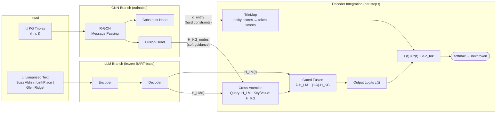

# Dual-Output GNN for KG-Grounded Faithful Text Generation

A novel architecture that leverages Knowledge Graphs to reduce hallucination in LLM-generated text. A single GNN backbone produces two complementary outputs — **soft fusion guidance** and **hard decoding constraints** — enabling faithful KG-to-text generation.

> **Status**: Research proposal & architecture design phase. Implementation not yet started.

## Architecture Overview

The core idea: a **single GNN** processes the knowledge graph and produces **two outputs** that guide the LLM decoder in complementary ways — soft attention fusion steers the hidden states, while hard constraint decoding directly boosts entity token probabilities.

## Key Contributions

- **Dual-output GNN**: A single R-GCN backbone with two heads — Fusion Head (per-node embeddings for cross-attention) and Constraint Head (per-entity scores for decoding constraints)
- **Learned constraints**: Unlike prior work using manual rules, our constraint scores are learned end-to-end
- **Gated fusion**: Adaptive blending of LLM hidden states and KG-informed representations at each decoding step
- **Frozen LLM**: Only the GNN, attention heads, and gate are trained — the LLM backbone (BART-base) remains frozen, keeping compute costs low

## Comparison with Prior Work

| Method | Fusion | Constraint | Notes |
|--------|--------|-----------|-------|
| GCR (2024) | Cross-Attention | Manual rules | Constraints not learned |
| KGPT (2020) | None | Hard constraint | Lacks flexibility |
| JointGT (2021) | Graph-Text Joint | None | No constraints |
| **Ours** | **Gated Fusion** | **Learned constraints** | **Single GNN, dual output** |

## Technical Details

- **LLM Backbone**: BART-base (140M params, hidden dim 768, frozen)
- **GNN**: R-GCN with 2-3 message passing layers
- **Training Loss**: L_total = L_task + β·L_align + γ·L_constraint
- **Negative Training**: Distractor Triple Injection for robustness
- **Target Datasets**: WebNLG (17K, primary), DART (62K, secondary)
- **Compute**: Feasible on Kaggle T4 x2 (trainable params < 2GB)

## Planned Experiments

1. Prototype with WebNLG + BART-base + R-GCN (2 layers)
2. Baseline comparison (BART-only, GCR, KGPT)
3. Ablation study (Fusion only, Constraint only, Both)
4. Secondary validation with T5-base, stretch goal with T5-large

## License

TBD
