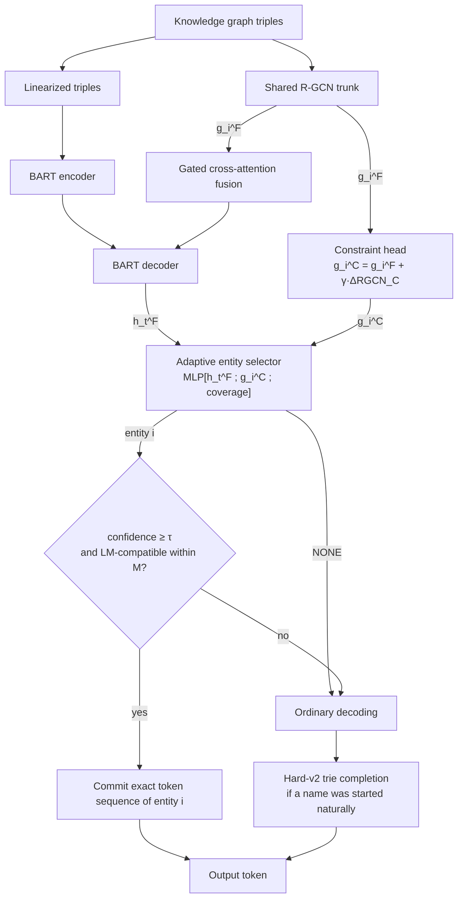

# Dual-Head Adaptive GNN

**Decoder-conditioned entity control for faithful knowledge-graph-to-text generation.**

A graph-fused BART that decides, *at every decoding step*, whether a knowledge-graph entity should be mentioned now and which one — then guarantees that entity is realized correctly. On the WebNLG test set this cuts entity hallucination from **5.01% to 1.19%** and raises entity recall from **78.5% to 86.4%**, while improving BLEU.

---

## Why step-wise control

A knowledge graph tells you *which* facts are true, but not *when* to say them. Earlier graph-to-text systems inject graph information into the encoder or hidden states and hope the decoder uses it. That leaves two failure modes untouched: entities that are simply never mentioned (omission), and entities whose names come out garbled — `Pontiac_Rageous` realized as *"Pontiac Romeo"*.

Both are decoding-time problems, so this architecture puts a learned controller at decoding time. The key design choice is a division of labour:

| Component | Question it answers | Type |
|---|---|---|
| Graph fusion | What does the graph mean here? | learned, continuous |
| Adaptive entity selector | Should an entity start at this token, and which one? | learned, discrete |
| Exact commitment | How is the chosen entity spelled? | deterministic |
| Hard-v2 completion | The model started a name on its own — how does it finish? | deterministic |

Learned components decide *what* and *when*; deterministic rules handle *how*, where a probabilistic model has nothing useful to add.

---

## Architecture



**Shared trunk, two heads.** One R-GCN encodes the graph. The fusion head feeds BART's decoder; the constraint head applies a residual, relation-aware refinement `g^C = g^F + γ·ΔRGCN_C(g^F)` specialised for the selection decision. The constraint head's output projection is zero-initialised, so training begins from a function-preserving point.

**The selector** scores `{NONE} ∪ {entities}` from `[h_t^F ; g_i^C ; coverage_t,i]` at every step. `NONE` lets the language model run untouched — most positions are not entity starts. Coverage masks entities already realized.

**Two gates before acting.** A confidence threshold (τ = 0.70) and a compatibility check — the entity's first token must be within M = 8.0 logits of the language model's own preference — so the controller cannot force grammatically implausible insertions.

**Deterministic realization.** On trigger, the entity's exact token sequence is committed, which removes prefix drift between entities sharing a prefix. Independently, when BART itself begins a graph-entity name, a name-only trie restricts continuations until the name is complete, with an escape margin so it can never trap the model.

---

## Results — WebNLG test set (2,510 unique inputs)

| System | BLEU ↑ | Hallucination ↓ | Entity recall ↑ | Corrupted names ↓ |
|---|---:|---:|---:|---:|
| BART baseline | 47.40 | 5.01% | 78.53% | 288 |
| + graph fusion | 47.32 | 3.75% | 79.99% | 142 |
| + graph fusion + Hard-v2 | 47.68 | 1.88% | 85.17% | 23 |
| Adaptive selector (shared representation) | 48.72 | 1.86% | 84.21% | 44 |
| Adaptive selector + Hard-v2 | **48.86** | 1.25% | **86.49%** | 21 |
| **Dual-Head Adaptive GNN** | 48.68 | 1.76% | 84.12% | 43 |
| **Dual-Head Adaptive GNN + Hard-v2** | 48.82 | **1.19%** | 86.36% | **21** |

Paired bootstrap over the same inputs, adaptive selection vs. graph fusion alone: **recall +4.13 pp** (95% CI [+3.61, +4.68]), **hallucination −1.99 pp** (95% CI [−2.33, −1.69]). The backbone (BART, R-GCN, fusion) is frozen while the selector trains, so these gains are attributable to the decoding controller rather than to a better-trained encoder.

The two representation variants — shared `g^F` and constraint-refined `g^C` — are statistically tied end-to-end (all paired CIs include zero); the dual-head reaches the lowest hallucination, the shared variant the highest recall and BLEU. The constraint head measurably improves the *selector itself* (F1 80.6 vs 79.2, entity-identity accuracy 91.9% vs 90.5%), which does not fully translate downstream because the confidence and compatibility gates already absorb much of that error class.

### By predicate novelty

| Subset | System | BLEU | Hallucination | Recall |
|---|---|---:|---:|---:|
| Seen (n=1,758) | fusion + Hard-v2 | 53.77 | 1.61% | 89.10% |
| Seen | Dual-Head + Hard-v2 | **54.53** | **0.88%** | **90.44%** |
| Unseen (n=752) | fusion + Hard-v2 | 35.69 | 2.54% | 76.01% |
| Unseen | Dual-Head + Hard-v2 | **36.63** | **1.92%** | **76.82%** |

Gains hold on unseen predicates, where the model has never observed the relation during training.

---

## Repository layout

```
src/
  kg_bart_core.py        R-GCN, gated fusion, model variants, training/eval loops
  adaptive_decoding.py   EntitySelector, ConstraintHead, TrieMapV2, hard completion
  grounding_metric.py    normalization-aware entity grounding metric
notebooks/
  00_test_set_preparation.ipynb     deduplicated evaluation set + reference pooling
  01_baseline_bart.ipynb            BART baseline
  02_graph_fusion_training.ipynb    R-GCN + gated fusion backbone
  03_hard_v2_completion_eval.ipynb  deterministic name completion
  04_adaptive_selector_training.ipynb   selector training (frozen backbone)
  05_dual_head_training.ipynb       constraint head + selector
  06_operating_point_selection.ipynb    τ / trigger-budget matching on dev
  07_final_test_evaluation.ipynb    frozen test evaluation
docs/
  ARCHITECTURE.md        component-level detail and design rationale
  RESULTS.md             full result tables, statistics, evaluation protocol
```

## Setup

```bash
pip install torch transformers torch-geometric sacrebleu rouge-score nltk
```

Notebooks are written for Google Colab with an A100; each expects the processed WebNLG artifacts and checkpoints in a Drive project folder. Run them in numeric order — `02` produces the fusion backbone the later stages freeze and build on.

## Evaluation protocol

Evaluation uses one row per unique triple set (2,510), with all human references for that input pooled, corpus-level BLEU, and an entity-grounding metric that normalizes diacritics, date verbalizations, name shortenings, articles and acronym spacing before deciding whether a mention is supported.

**Scope of the claims.** Results come from a single training seed per configuration and a frozen post-development evaluation — decoding parameters were fixed on development data before the test run, but the test set informed earlier design decisions, so these numbers are descriptive rather than a clean held-out confirmation. The grounding metric counts entity mentions and does not by itself detect relation-direction errors; a triple-level factuality audit is in progress. Multi-seed replication and an external dataset (DART, KGQA) are the next steps.

## Citation

```bibtex
@misc{dualhead_adaptive_gnn,
  title  = {Dual-Head Adaptive GNN: Decoder-Conditioned Entity Control for
            Faithful Knowledge-Graph-to-Text Generation},
  author = {Vatine},
  year   = {2026},
  url    = {https://github.com/vatine12/Dual-Head-Adaptive-GNN}
}
```
